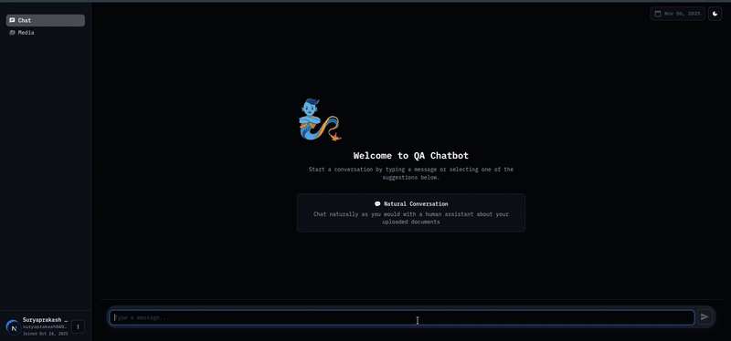
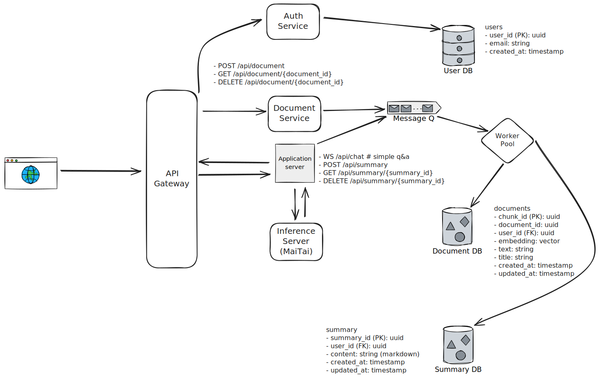

# Question & Answering ChatBot 
RAG agent for Q&A and summary generation

## Demo



## System Design



## Frontend Setup

### Prerequisites
- Node.js (v16 or higher)
- npm or yarn

### Installation

1. Navigate to the frontend directory:
```bash
cd frontend
```

2. Install dependencies:
```bash
npm install
```

3. Start the development server:
```bash
npm run dev
```

The application will be available at `http://localhost:3000`

## Backend Setup

### Prerequisites
- Python 3.13+
- Redis server

### Installation

1. Navigate to the backend directory:
```bash
cd backend
```

2. Create and activate virtual environment:
```bash
python3.13 -m venv venv
source venv/bin/activate  # On Linux/macOS
# venv\Scripts\activate   # On Windows
```

3. Install dependencies:
```bash
pip install -r requirements.txt
```

4. Setup environment variables:
```bash
# Copy the example environment file
cp .env.local .env

# Edit .env and add your API keys:
# ENVIRONMENT="development"
# OPENROUTER_META_API_KEY=your_llama_api_key
# OPENROUTER_GPT_OSS_KEY=your_gpt_oss_api_key  
# OPENROUTER_QWEN_KEY=your_qwen_api_key
# 
# Add Supabase credentials:
# SUPABASE_URL_DEV=your_supabase_url
# SUPABASE_ANON_KEY_DEV=your_supabase_anon_key
# SUPABASE_SERVICE_ROLE_KEY_DEV=your_supabase_service_role_key
```

5. Start Redis server:
```bash
sudo systemctl start redis-server
# Or with Docker: docker run -d -p 6379:6379 redis:7-alpine
```

6. Run the application:
```bash
uvicorn app.main:app --reload --host 0.0.0.0 --port 8000
python3 launch_workers.py  
```

The API will be available at `http://localhost:8000/docs`

### Features
- Upload documents for RAG-based question answering
- Interactive chat interface
- Document-based query responses
